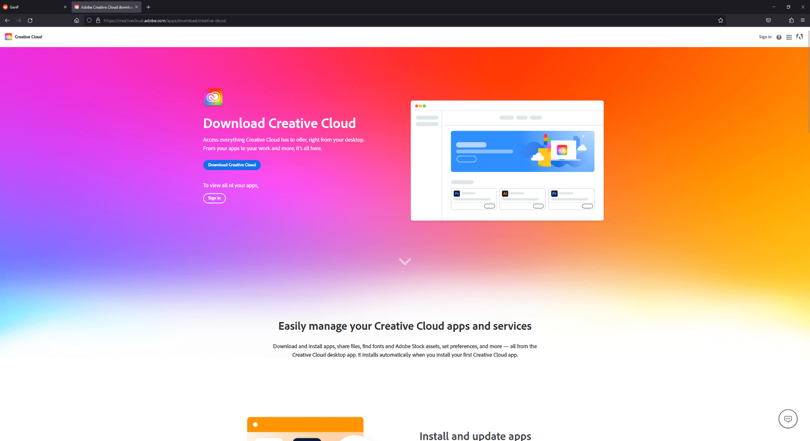
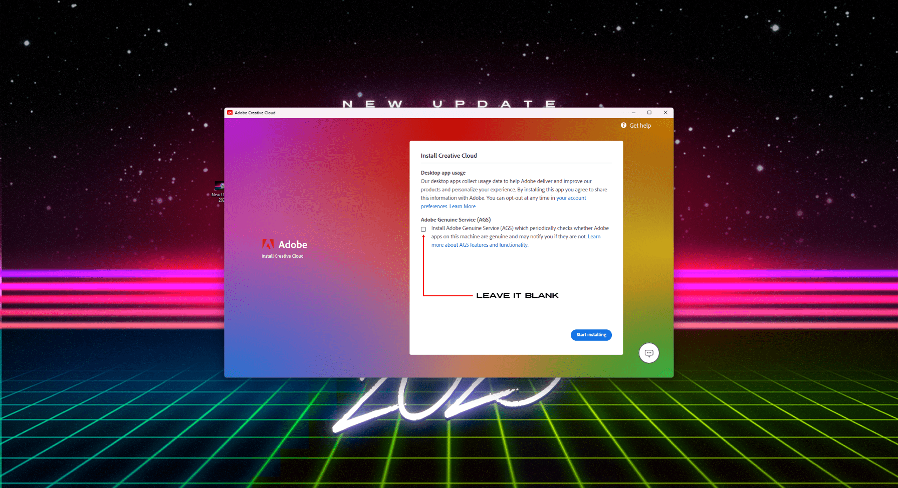
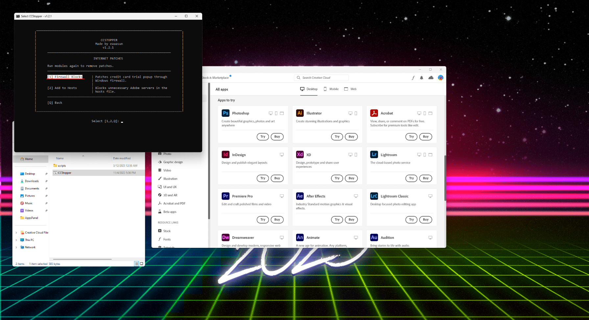
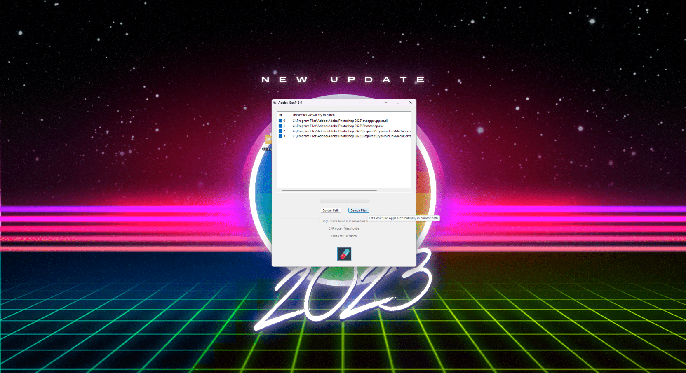

<!-- Links -->
[Creative Cloud]: https://creativecloud.adobe.com/apps/download/creative-cloud
[Genp 3.0 modded]: https://www.mediafire.com/file/ipp9gj15xzty1uw/GenP_3.0_Release.zip/file
[CCStopper Download]: https://github.com/eaaasun/CCStopper/releases
[Unlicensed App Popup fix]: https://www.reddit.com/r/GenP/comments/ue47y6/possible_solution_to_unlicensed_app_popup_no/
[Compatibility List]: https://www.reddit.com/r/GenP/comments/yao439/update_compatibility_list_2023_creative_suite/

<!-- Main Content Start -->
# GenP Patching Method

## Downloading the required things

Download the below things to your pc to one folder
1. [Creative Cloud]
2. [Genp 3.0 modded] (it has additional Portable CCStopper modules, AppsPannel Beta Patches with Readme files with respective instructions.)
3. [CCStopper Download]

# Procedure
!!!info
If you are having "Unlicensed popups | App will be disabled | Not loading or looping CC", Try [Unlicensed App Popup fix]
!!!

## 1. Download Genp 3 - Modded version, CCStopper, and extract contents from zip

**Sometimes Antivirus deletes/moves the Genp.exe into quarantine.**  

You can either choose to **assign permission as safe** (letting it remain in the folder) or **disable antivirus while extracting**. This will fix the issue of the .exe not appearing in the folder after extracted.

## 2. Install Creative Cloud

* You need to create a free a account or use one you already have, preferably without any subscription (mainly to avoid headaches).
* When asked during setup do **NOT install AGS** (Adobe Genuine Service)
* **Disable Auto-Update** on its settings if possible.
* After installation is done go Menu > File > Exit Creative Cloud.

## 3. Replace Try with Install buttons using the Modded Utilities.

1. In your file Explorer, go to:  
  `C:\Program Files (x86)\Common Files\Adobe\Adobe Desktop Common\AppsPanel`

2.  Create a folder named "BACKUP" and move the files **AppsPanel.pimx, AppsPanelBL.dll and AppsPanellL.dll** into it. *(this is mainly a safeguard if you want to restore to default at later date)*

3. Inside the **Genp 3 - Modded folder** in Utilities, there will be another 2 "AppsPanel" files. You will copy these into the directory of the AppsPanel folder (NOT THE BACKUP FOLDER)

## 4. Use CCStopper to block ADS via Firewall (blocking internet)

1. **Run CCstopper as admin.** - You will be shown a menu which the following are the options you must hit with the keyboard.
2. Type 2 (for Internet Patch)
3. Type 1 (for Firewall Block).

!!!info 
You have to hit both in the given order. i.e after opening first hit The Internet Patch option then hit The Firewall Block Option.
!!!

4. Once that is done, you can select (Q) to quit CCStopper.

**Following steps are crucial at the moment**

1. Go to `Windows Firewall > Advanced Settings`
2. Go to **Outbound Rules** (top left corner) you should have the rules created by CCStopper that block **Adobe Desktop Service** and few other services.

3. Keep this page open

4. Reopen Creative Cloud - if it takes a little longer to load simply **disable them**, wait until you enter the homepage, **and then re-enable them again**

==- What does the above steps do?

*This is simply an explanation of what CCstopper does automatically with the use of the firewall rule*

* OUTBOUND: Stops information from leaving PC to the Server, helps bypass Credit Card prompt.

* INBOUND: Stops information coming from Server to PC, helps bypass the trial countdown or app will be disabled prompt.

Later you can disable or enable depending on your needs.

*If antivirus is managing firewall settings, then you must create them in your antivirus firewall settings instead and not on windows.*

1. Goes to `Windows Firewall > Advanced Settings`

2. Creates an **Outbound** rule on **Adobe Desktop Service**

3. Path of ADS - `C:\Program Files (x86)\Common Files\Adobe\Adobe Desktop Common\ADS\Adobe Desktop Service.exe`

**How to create it:**

* **Rule type:** Program

* **Program:** (Paste the directory above and select the application.exe)

* **Action:** Block the connection

* **Profile:** All

* **Name:** (Choose a name that you will remember what it does)

* This rule is what causes CreativeCloud to take longer to load or constantly loop, but its necessary to get in the app without triggering the CreditCard popup.

**Just remember that**

- Disabled: CreativeCloud works like normaly, but you cant download due to CreditCard popup.

- Enabled: The opposite happens, free to download but its stubborn a bit.

===

## 5. Install Apps you want (Trial and Error)

- If the buttons didn't get replaced with install, click on Try nonetheless and see if it starts downloading.
- Install all the apps you want in one go but don't open them yet. Wait until everything is installed, don't rush.

## 6. Run GenP on the installed apps

1. Open `GenP folder > Resources > Run GenP file`

!!!
If you're having issues opening it, turn AntiVirus OFF and try again.
!!!

3. Click **"Search Files"** and wait. *(will look at the default locations, use custom path if installed somewhere else)*
4. You can de-select paths in case you have any versions you dont want to patch. (in case of using Monkrus Acrobat)
5. Finally click the **PILL** to run the patch.

**Everything should be working now**

## Optional - Block Each Installed app via Firewall

*(Case of issues like app will be disabled, day counter, unable to launch app due to some popup)*

1. Go to `Windows Firewall > Advanced Settings`
2. Create **Inbound and Outbound** rule on each app with issues  
**Typical path should be:** `C:\Program Files\Adobe\ (find respective folder for the app.exe)`

## Optional - Block AGS via Firewall - *(similar to step 4)*

1. Create both **Inbound** and **Outbound** rules on **Adobe Genuine Service**  
Path of AGS - `C:\Program Files (x86)\Common Files\Adobe\Adobe Desktop Common\AdobeGenuineClient\AGSService.exe`

!!!warning ATTENTION
  Always check first the monthly **[Compatibility List]** before updating any apps, otherwise don't update.  
  If you want to install / update more apps, hit "**Install/Update**" on New app, let it download, and **run GenP** on them again.
!!!
