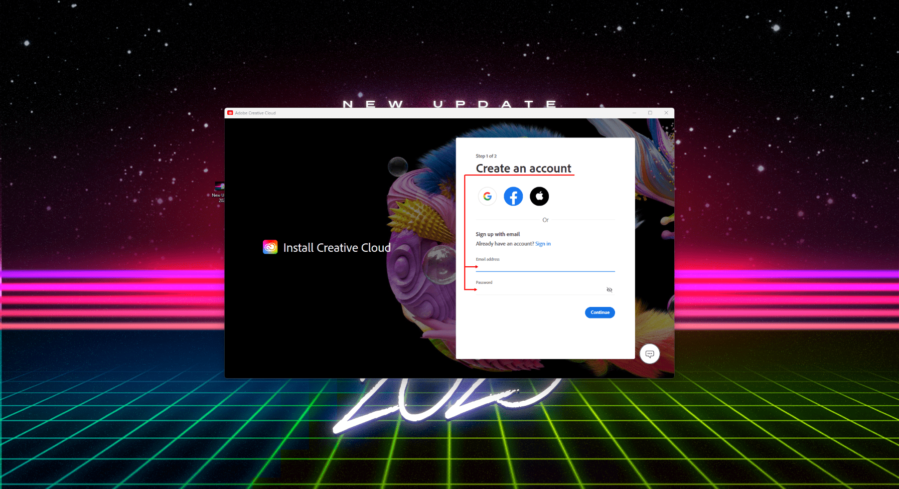
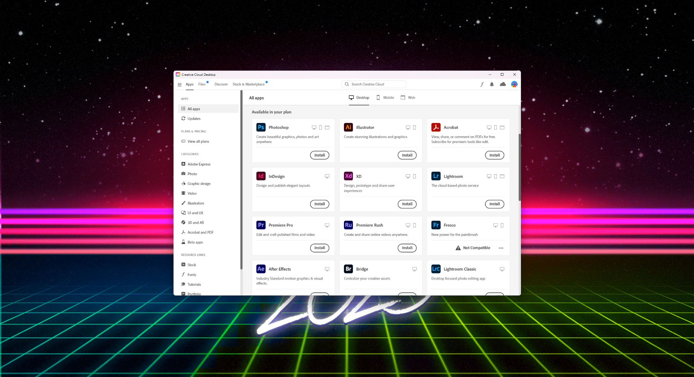

<!-- Links  -->
[5]: https://www.reddit.com/r/GenP/comments/164ew74/compatibility_list_2024_creative_suite/

[8]: https://www.reddit.com/r/GenP/comments/mt9m4f/adobe_home_screen_fix_402

[9]: https://github.com/eaaasun/CCStopper/releases
[10]: https://helpx.adobe.com/creative-cloud/kb/cc-cleaner-tool-installation-problems.html
[11]: https://creativecloud.adobe.com/apps/download/creative-cloud
[12]: https://www.mediafire.com/file/3lpsrxiz47mlhu2/Adobe-GenP-2.7.zip/file
[13]: https://www.revouninstaller.com/

[15]: https://w14.monkrus.ws/search?q=Adobe+Lightroom+Classic&max-results=20&by-date=true

[17]: https://www.qbittorrent.org/download.php
[18]: https://w14.monkrus.ws/search?q=Adobe+Photoshop&max-results=20&by-date=true
[19]: https://w14.monkrus.ws/search?q=Adobe+Illustrator&max-results=20&by-date=true
[20]: https://w14.monkrus.ws/search?q=Adobe+Premiere+Pro&max-results=20&by-date=true
[21]: https://w14.monkrus.ws/search?q=Adobe+After+Effects&max-results=20&by-date=true
[22]: https://w14.monkrus.ws/search?q=Adobe+Animate&max-results=20&by-date=true
[23]: https://w14.monkrus.ws/search?q=Adobe+Character+Animator&max-results=20&by-date=true
[24]: https://w14.monkrus.ws/search?q=Adobe+Acrobat+Pro&max-results=20&by-date=true
[25]: https://w14.monkrus.ws/search?q=Adobe+Substance&max-results=20&by-date=true
[26]: https://w14.monkrus.ws/search?q=Adobe+Audition&max-results=20&by-date=true
[27]: https://w14.monkrus.ws/search?q=Adobe+XD&max-results=20&by-date=true
[28]: https://w14.monkrus.ws/search?q=Adobe+InDesign&max-results=20&by-date=true
[29]: https://w14.monkrus.ws/search?q=Adobe+Speech+to+Text&max-results=20&by-date=true
[30]: https://w14.monkrus.ws/search?q=Adobe+Master+Collection+2023&max-results=20&by-date=true
[31]: https://w14.monkrus.ws/search?q=Adobe+Media+Encoder&max-results=20&by-date=true
[32]: https://www.mediafire.com/file/jr0jqeynr4h21f9/Adobe_GenP_3.0.zip/file
[33]: https://www.mediafire.com/file/ipp9gj15xzty1uw/GenP_3.0_Release.zip/file
[34]: https://www.mediafire.com/file/ppdtzb3elfzw987/Acropolis_V1.10.zip/file
[35]: https://w14.monkrus.ws/search?q=firefly&amp;max-results=20&amp;by-date=true
[36]: https://www.reddit.com/r/GenP/comments/ue47y6/possible_solution_to_unlicensed_app_popup_no/


<!-- Links End Main content Start -->

# Genp Method

> **~~[Video Tutorial: Updated Guide #2 - CC+GenP](https://odysee.com/@genp/guide2)~~ - Video outdated due to new versions of Genp, CCstopper and others**

[CURRENT UPDATED Video Tutorial October 2023:](https://youtu.be/EdO29DuUBHo) - Thanks to the user upload for the straightforward video, hope it helps others

## Downloads Needed

- 🔗 [Creative Cloud (CC)][11]
- 🔗 [GenP 3.0 - Modded][33]

## Instructions

### 1. Download Genp 3 - Modded, and extract ALL contents from zip  
  **Antivirus may sometimes delete or move files into quarantine.**
  **You can either whitelist as safe or disable antivirus while extracting. This will fix the issue of **.exe** not showing in the folder after extracted.**

### 2. Download & Install Creative Cloud  
   - Create a free account or use one you already have, preferably without any ongoing subscription *(avoid problems)*
   - During setup, *if possible* do **NOT install AGS** (Adobe Genuine Service)
   - Once installed go to `Menu > File > Preferences` and **disable the following:**
     - Launch at login
     - Sync files in the background after quitting
     - Automatically keep it updated
     
   - Once that is done go `Menu > File > Exit Creative Cloud`





### 3. Replace Try with Install buttons using Windows Powershell as ADMIN
***Thanks AbsentForeskin***  
*Adobe Creative Cloud `v.5.11.0.522.1` (June 2023 - latest)*  
*Last updated July 5, 2023*  

!!!warning Warnings
**IMPORTANT:** Do not apply this patch if you have already made any changes to `AppsPanelBL.dll` or `AppsPanelIL.dll`.
**NOTE:** Additional firewall rules or other network changes are not necessary or recommended while using this patch.
!!!
#### Overview
Restoring the "Install" buttons in Creative Cloud Desktop—in place of "Try" buttons, which demand payment information—is possible with PowerShell commands on the current latest release of <:ACC:1123114215285211198> Adobe Creative Cloud (`v.5.11.0.522.1`). Before you proceed, ensure this is the exact version specified in the "About Creative Cloud" menu, as displayed below—


(If you can't see the image above, it's possible that the source of this part might have updated, visit [discord](https://discord.com/channels/808943947660394517/971079960255164477) to see the updated part for this section).

#### Usage & Steps
Click Windows Button and write "Windows Powershell" right-click, Run as Administrator  
Enter the following command first:
```powershell
Stop-Process -Name "Adobe Desktop Service" -force
```
Enter the following command to create a backup of your current Apps Panel—

```powershell
cp "C:\Program Files (x86)\Common Files\Adobe\Adobe Desktop Common\AppsPanel\AppsPanelBL.dll" "C:\Program Files (x86)\Common Files\Adobe\Adobe Desktop Common\AppsPanel\AppsPanelBL.dll.bak"
```
After creating a backup with the above command, apply the Apps Panel patch by pasting the entirety of the following code block into PowerShell and press ENTER—

```powershell
$bytes  = [System.IO.File]::ReadAllBytes("C:\Program Files (x86)\Common Files\Adobe\Adobe Desktop Common\AppsPanel\AppsPanelBL.dll")
$bytes[1116554] = 0xfe
$bytes[1216383] = 0xfe
$bytes[1987439] = 0xfe
$bytes[2150557] = 0xfe
$bytes[2151982] = 0xfe
$bytes[2152497] = 0xfe
$bytes[2153297] = 0xfe
$bytes[2279801] = 0xc6
$bytes[2279802] = 0x40
$bytes[2279811] = 0xc6
$bytes[2279812] = 0x40
$bytes[2279821] = 0xc6
$bytes[2279822] = 0x40
[System.IO.File]::WriteAllBytes("C:\Program Files (x86)\Common Files\Adobe\Adobe Desktop Common\AppsPanel\AppsPanelBL.dll", $bytes)
```

If the console prints no errors, restart your machine. Upon startup, Creative Cloud will be ready for use.

#### Error Checking
If you receive an error stating that the file is being used by another process, then Creative Cloud is still partially running. Enter the following command to exit the running service—  

```powershell

```
Following that command, re-enter the same code block again—

Restart your machine after entering the code block. Upon startup, Creative Cloud will be patched and ready for use.

#### To Restore AppsPannel
To restore from the previously made backup, use the following command—

```powershell
cp "C:\Program Files (x86)\Common Files\Adobe\Adobe Desktop Common\AppsPanel\AppsPanelBL.dll.bak" "C:\Program Files (x86)\Common Files\Adobe\Adobe Desktop Common\AppsPanel\AppsPanelBL.dll"
```

If no errors are printed to the console, restart your machine. Upon startup, Creative Cloud will be returned to normal functionality—


==- Old Method (Might not Work)
   - Go to the **default** folder for adobe in your file Explorer:  
   `C:\Program Files (x86)\Common Files\Adobe\Adobe Desktop Common\AppsPanel`  

   - Create a folder inside it named "BACKUP" and move the following files *(If you have them)* to it:  
    **AppsPanel.pimx, AppsPanelBL.dll and AppsPanellL.dll**  
    *(in case you want to restore them to default at a later date)*  

   - Go to `Genp 3 - Modded > Utilities > restore install buttons [beta]`, there will be another 2 "AppsPanel" files. You will copy these into the default AppsPanel folder (NOT THE BACKUP ONE).


===

### 4. Use CCStopper to block ADS via Firewall (blocking internet)
   - **Run CCstopper as admin.** - You should be shown a menu with the following options which you must hit using the keyboard.  
   (2) for Internet Patch  
   (1) for Firewall Block.  

   Once that is done, you can select (Q) to quit CCStopper.


!!!
**PAY ATTENTION** - Firewall Rules should be in effect, therefore they won't let Creative Cloud load or Update *(this is intentional)*.  
⚠️ If antivirus is managing firewall settings, then you must create them in your antivirus firewall settings instead and not on windows *(whichever it is must be ON for the rules to take effect)* .
!!!

   - 💡Turn `Windows Firewall OFF`, then open Creative Cloud and wait for it to load, once its loaded then turn `Windows Firewall ON`
   - 🔁 **Repeat this process everytime you need to download other apps but get server error**  

(If you do not care for the explanation of this, you may skip to step 5)

==- ⚠️ Informational purpose only of step 4

*Explanation of what CCstopper does automatically with the use of the firewall rule*

Basically you are allowing internet access to Creative Cloud to load properly and blocking it again, by disabling and enabling the firewall rules.

Later you can disable, enable or delete them depending on your needs.
   * OUTBOUND: Stops information from leaving PC to the Server, helps bypass Credit Card prompt.
   * INBOUND: Stops information coming from Server to PC, helps bypass the trial countdown or app will be disabled prompt.

**How to add the same rules to firewall manually.**

- Go to `Windows Firewall > Advanced Settings`
- Create **Outbound** rules on the following:
   **Path of ADS** - `C:\Program Files (x86)\Common Files\Adobe\Adobe Desktop Common\ADS\Adobe Desktop Service.exe`
   **Path of Licensing** - `C:\ProgramFiles\Common Files\Adobe\Adobe Desktop Common\NGL\adobe_licensing_wf.exe`
   **Path of Licensing helper** - `C:\ProgramFiles\Common Files\Adobe\Adobe Desktop Common\NGL\adobe_licensing_wf_helper.exe`

**How to create it:**

   * **Rule type:** Program
   * **Program:** (Paste the directory above and select the application.exe)
   * **Action:** Block the connection
   * **Profile:** All
   * **Name:** (Choose a name that you will remember what it does)

If you prefer to do this manually, you can add the following two lines to the system hosts file (located in `C:\Windows\System32\drivers\etc)` using a text editor of your choice:

**Just remember that**

- Disabled: CreativeCloud works like normaly, but you cant download due to CreditCard popup.
- Enabled: The opposite happens, free to download but its stubborn a bit.

⚠️ **END of Informational purpose only of step 4**

===

### 5. Open Creative Cloud > Apps > Install

   - You should now have the install button, install all the apps you want, wait until everything is installed and DON'T OPEN ANY YET.
   
   - Generative Fill / AI online features on PS or others DO NOT WORK ANYMORE - stop asking about it

   - It's been adapted into the monthly credits for verified paying users (paywall). Therefore, its gone.

   - Once that is done go `Menu > File > Exit Creative Cloud`



### 6. Run GenP on the installed apps
   - Open `GenP folder > Resources > Run GenP file`

   - If you're having issues opening it, turn AntiVirus OFF and try again, however **don't forget to turn it back ON after its patched**.

   - Click **"Search Files"** and wait. *(will look at the default locations, use custom path if installed somewhere else)*

   - You can de-select paths in case you have any programs you dont want to patch. (in case of using Monkrus Acrobat)

   - Finally click the **PILL** to run the patch.


   - Everything should be working now


!!!warning
OPEN THE APPS THROUGH THEIR .EXE and NOT FROM Creative Cloud.
Meaning press Windows button, write name of app you wanna use that was patched > Open
!!!

### 7. Block Adobe Genuine Service URL
***Thanks AbsentForeskin***  
Use the following two commands in PowerShell (admin) if your apps are warning you of unlicensed or non-genuine usage.
```
Add-Content -Path $env:windir\System32\drivers\etc\hosts -Value "`n0.0.0.0`tm59b4msyph.adobe.io" -Force
```
```
Add-Content -Path $env:windir\System32\drivers\etc\hosts -Value "`n0.0.0.0`tic.adobe.io" -Force
```
If you prefer to do this manually, you can add the following two lines to the system hosts file (located in `C:\Windows\System32\drivers\etc`) using a text editor of your choice—
```
0.0.0.0 m59b4msyph.adobe.io
0.0.0.0 ic.adobe.io
```

**Everything should be working now**

### 8. Optional, therefore ignore - Block Each Installed app via Firewall  
   *(In case of issues like app will be disabled, day counter, unable to launch app due to some popup)*
   - Go to `Windows Firewall > Advanced Settings`  

   - Create **Inbound and Outbound** rule on each app with issues  
   **Structure is the following:**  

     - File Type: Program 
     - Program: It's necessary to select the actual "program".exe inside the folder that was installed because the shortcut will not work.
       - **Typical path example would be:** `C:\Program Files\Adobe\Adobe Photoshop 2023\Photoshop.exe` (Find the proper path for the app you need)  
     - Action: Block Connection  
     - Profile: All  
     - Name: Name it whatever you want to know what's blocking.  

### 9. Optional, therefore ignore - Block AGS via Firewall - *(similar to step 4)*
   -  Create both **Inbound** and **Outbound** rules on **Adobe Genuine Service**  
   Path of AGS - `C:\Program Files (x86)\Common Files\Adobe\Adobe Desktop Common\AdobeGenuineClient\AGSService.exe`

!!!
Always check first the monthly **[Compatibility List][5]** before updating any apps, otherwise don't update.  
If you want to install / update more apps, hit "**Install/Update**" on New app, let it download, and **run GenP** on them again.  
If something ain't working properly check **[Issues Fix][36]**  
!!!